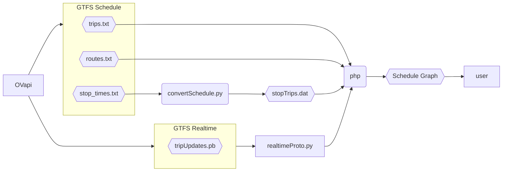

# OV Timetable Graph

This repository contains the code for my website's OV Timetable Graph thingy. It going to show a cool graph with a live feed of all the trips between your favorite train/bus/tram/metro/ferry/etc stops in the Netherlands.

I would advice against using this for anything of your own, it's specifically made for my use-case (the website).
The tool uses the GTFS feed provided by the OVapi. This means that it needs to parse a proto2 protobuf file. I could not for the life of me find out how to get php to parse one, so we're doing it in Python lol.
My website is hosted on a Strato server which I don't have full control over. I have absolutely no clue how to compile C or C++ for it, so I decided to use Python.

Both this text and graph are very outdated, this project is still somewhere on my todo list. One day it will happen

Here's a graph of how it kinda works or something here you go:

